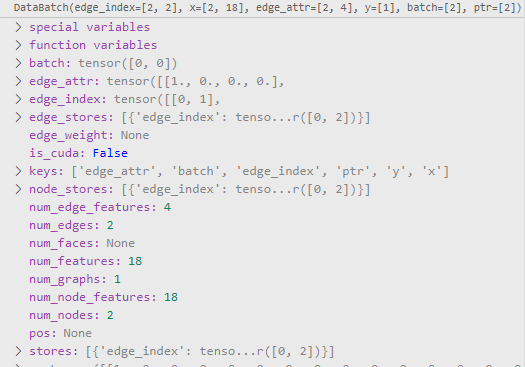

sageconv里面的有两层映射层，lin_l, lin_r分别对应邻居节点变换，自身节点变换https://pytorch-geometric.readthedocs.io/en/latest/_modules/torch_geometric/nn/conv/sage_conv.html#SAGEConv


为什么要加：x: OptPairTensor的用法 x = (x, x)，因为可能有二分图这种情况，如果是正常的图的话，也很方便对邻接节点和中心节点做计算

比如（x，x）其中第一个x经过邻接节点聚合变成了x_j, 此时刚好用第二个x作为中心节点的表征，最终对中心节点和邻接节点进行结合，即x+x_j

(https://github.com/pyg-team/pytorch_geometric/issues/1496)


注意sparse的用法，对于有向图才需要transpose，无向图的transpose等于原来的图

https://pytorch-geometric.readthedocs.io/en/latest/notes/sparse_tensor.html


注意message_and_aggregate可以用来直接对sparse_tensor进行传递消息和聚合的步骤

https://zhuanlan.zhihu.com/p/535787559


sageconv的一套base代码


```
def forward(self, x: Union[Tensor, OptPairTensor],
                edge_index: Tensor
            ) -> Tensor: 

        row, col = edge_index
        # x_j为聚合后的x_j，按照0-row.max().item()+1顺序排列
        x_j = scatter.scatter(x[col], row, dim=0, dim_size=x.size(0), reduce='mean')
        x_j = self.lin_l(x_j)
        x_i = self.lin_r(x)

        out = x_j + x_i

        if self.normalize:
            out = F.normalize(out, p=2., dim=-1)
            
            
sparse:
		adj_t = adj_t.set_value(None, layout=None)
        x_j = matmul(adj_t, x, reduce=self.aggr)

        x_j = self.lin_l(x_j)
        x_i = self.lin_r(x)
        out = x_j + x_i

        if self.normalize:
            out = F.normalize(out, p=2.0, dim=-1)
```


#### pyg neighbor

返回的nodes是包括了邻居采样的nodes

前batch_size个才是中心nodes，即为我们要计算的nodes

x也是按照nodes的顺序(0,1,2,3...)进行的排列，而不是按照nodes本身的节点号进行的排列

所以在out输出的时候，也只有前batch_size个才是通过邻居传递消息聚合的

所以最后算loss，也是用这部分batch的out和batch的y进行计算


#### message passing

函数遵循 propagate -> message -> aggregate -> update的步骤进行特征传播

其中aggregate函数是隐式定义的，即初始化中的aggr="add"

`propagate(edge_index, size=None, **kwargs)`

调用message和aggregate，message中接收**kwargs中的所有参数

传递给`propagate()`方法的参数，如果是节点的属性的话，可以被拆分成属于中心节点的部分和属于邻接节点的部分，只需在变量名后面加上`_i`或`_j`。例如，我们自己定义的`meassage`方法包含参数`x_j`，那么首先`propagate()`方法将节点表征拆分成中心节点表征和邻接节点表征，接着`propagate()`方法调用`message`方法（message再调用aggregate方法，将源节点传递过来的消息聚合在目标节点（按照row的顺序）上，返回聚合后的x_j, 即聚合后的x_j内包含的是按照row自身的从0开始的有序的顺序聚合成功的邻接节点的信息)。

```
out = self.aggregate(out, **aggr_kwargs)
其中aggr_kwargs = self.inspector.distribute('aggregate', coll_dict)
coll_dict中包括了index，dim，dim_size等信息，所以可以进行scatter

def __collect__(self, args, edge_index, size, kwargs):
        i, j = (1, 0) if self.flow == 'source_to_target' else (0, 1)

        out = {}
        for arg in args:
            if arg[-2:] not in ['_i', '_j']:
                out[arg] = kwargs.get(arg, Parameter.empty)
            else:
                dim = j if arg[-2:] == '_j' else i
                data = kwargs.get(arg[:-2], Parameter.empty)

                if isinstance(data, (tuple, list)):
                    assert len(data) == 2
                    if isinstance(data[1 - dim], Tensor):
                        self.__set_size__(size, 1 - dim, data[1 - dim])
                    data = data[dim]

                if isinstance(data, Tensor):
                    self.__set_size__(size, dim, data)
                    data = self.__lift__(data, edge_index, dim)

                out[arg] = data

        if isinstance(edge_index, Tensor):
            out['adj_t'] = None
            out['edge_index'] = edge_index
            out['edge_index_i'] = edge_index[i]
            out['edge_index_j'] = edge_index[j]
            out['ptr'] = None
        elif isinstance(edge_index, SparseTensor):
            out['adj_t'] = edge_index
            out['edge_index'] = None
            out['edge_index_i'] = edge_index.storage.row()
            out['edge_index_j'] = edge_index.storage.col()
            out['ptr'] = edge_index.storage.rowptr()
            if out.get('edge_weight', None) is None:
                out['edge_weight'] = edge_index.storage.value()
            if out.get('edge_attr', None) is None:
                out['edge_attr'] = edge_index.storage.value()
            if out.get('edge_type', None) is None:
                out['edge_type'] = edge_index.storage.value()

        out['index'] = out['edge_index_i']
        out['size'] = size
        out['size_i'] = size[i] if size[i] is not None else size[j]
        out['size_j'] = size[j] if size[j] is not None else size[i]
        out['dim_size'] = out['size_i']

        return out
        
        
def aggregate(self, inputs: Tensor, index: Tensor,
                  ptr: Optional[Tensor] = None,
                  dim_size: Optional[int] = None) -> Tensor:
        r"""Aggregates messages from neighbors as
        :math:`\square_{j \in \mathcal{N}(i)}`.

        Takes in the output of message computation as first argument and any
        argument which was initially passed to :meth:`propagate`.

        By default, this function will delegate its call to the underlying
        :class:`~torch_geometric.nn.aggr.Aggregation` module to reduce messages
        as specified in :meth:`__init__` by the :obj:`aggr` argument.
        """
        return self.aggr_module(inputs, index, ptr=ptr, dim_size=dim_size,
                                dim=self.node_dim)
```


message中，**edge上的信息或其它信息例如整个graph或subgraph的attributes等，可以直接传入，对shape之类的并没有什么约束，换句话说self.proppagate(edge_index,x) 之外，其它部分的inputs基本上没有限制，传入字符串，数字，数组都没什么问题。**

message function 就类似于 pandas.groupby ，根据 edge index 先进行分group；

注意继承messagepassing的时候要注意node_dim，默认是-2，但是在self attention含有head头的时候，这时候是-3，所以要把node_dim改成0，才能正确索引x的值

#### conv

一般x可以变成OptPairTensor的都是因为有向图/二部图

如果是单向边的话直接改sourse_to_target来确定聚合的方向

sageconv in_channels有两层的原因主要是因为可能有二分图


transformer中为什么query_i 和 key_j是点积？`alpha = (query_i * key_j).sum(dim=-1) / math.sqrt(self.out_channels)`

因为query_i和key_j是从x[col]和x[row]中取到的，i和j刚好一一对应有边，所以计算权重数量的时候直接点乘就可以了 （另一种是类别nlp里面的，unsqueeze(2)变成 [N, H, 1, C] @ [N, H, C, 1]再squeeze）

然后在softmax中，是分子是和i相连的j的这条边的相似度，分母是和i相连的所有边的sum

所以不能用普通的F.softmax(dim=-1)进行取值。

***（非常重要，在这里最开始是按照nlp里面的transformer思路去实现的，但是最后发现不一样）

可以参考pyg的softmax实现


在conv层中如果存在注意力机制计算时，如果它发生在message阶段，消息无法传递出来，那么此时可以先在message设置 self._alpha = None，然后再在message中设置 self._alpha = alpha，再在外面设置alpha = self._alpha，self._alpha = None。见（transformerconv的实现和https://github.com/pyg-team/pytorch_geometric/issues/1986）


在对邻居节点表征x_j进行计算的时候，scatter最后返回的是按照[0~N-1]的顺序排列的reduce后的结果


先进行线性变换再add，还是先进行concat再进行线性变换的一个issue

这两个是等价的

https://github.com/pyg-team/pytorch_geometric/issues/4184

https://github.com/pyg-team/pytorch_geometric/issues/2074

同理，先x[row]再W和先xW再[col]是一样的


NeighborLoader：

按照层数把所有采样需要的节点信息进行保存，返回的data包括data.x, data.edge_index, data.y

其中前batch个就是input_nodes的信息，其他节点则是被采样的邻居节点的信息

注意：返回的x和edge_index是子图里面重新进行了编号的，映射回去的方法可以是先给data.n_id赋值

返回的edge_index上面的是src，指向下面的待更新节点target，通过一个scatter刚好可以利用1-hop邻接节点给target节点进行更新

见https://github.com/pyg-team/pytorch_geometric/issues/3535


一个关于层数和采样节点层数的理解https://github.com/pyg-team/pytorch_geometric/discussions/3799


data的一些基本函数

https://github.com/pyg-team/pytorch_geometric/blob/873cd56fbcea2ad1cf109d6f6dddf62cfc6620db/torch_geometric/data/storage.py#L489


pyg新特性 aggr

使用方法和原来的scatter一样，但是支持了很多新的聚合方法，也可以用在Message Passing聚合的时候的aggr方法

```
from torch_geometric.nn import aggr

# Simple aggregations:
mean_aggr = aggr.MeanAggregation()
max_aggr = aggr.MaxAggregation()

# Advanced aggregations:
median_aggr = aggr.MedianAggregation()

# Learnable aggregations:
softmax_aggr = aggr.SoftmaxAggregation(learn=True)
powermean_aggr = aggr.PowerMeanAggregation(learn=True)

# Exotic aggregations:
lstm_aggr = aggr.LSTMAggregation(in_channels=..., out_channels=...)
sort_aggr = aggr.SortAggregation(k=4)
```

也可以用在Message Passing聚合的时候的aggr方法

```
class MyConv(MessagePassing):
    def __init__(self, ...):
        # Use a learnable softmax neighborhood aggregation:
        super().__init__(aggr=aggr.SoftmaxAggregation(learn=True))

   def forward(self, x, edge_index):
       ....
```

pyg data只需要一部分放到cuda上时：

data = data.to(device, 'x')

见：https://github.com/pyg-team/pytorch_geometric/blob/master/torch_geometric/data/storage.py


pyg图数据变成dataloader（此图batch_size=1）



其中edge_index和x就是这整个batch_size里面所有的图的edge_index和x放一起

其中的batch大小就是这个loader里面节点的数量的大小，表示这个节点属于哪个图（所以很适合用来scatter）


pyg的adj_t

```
store.adj_t = SparseTensor(
                row=store.edge_index[1], col=store.edge_index[0],
                value=None if self.attr is None or self.attr not in store else
                store[self.attr], sparse_sizes=store.size()[::-1],
                is_sorted=True, trust_data=True)
```

可以看到是row和col做了转置，在torch_sparse库中的matmul库中需要传入adj_t

但是adj_t到edge_index需要：

```
row, col, value = adj_t.t().coo()
edge_index = torch.stack([row, col], dim=0)
```

